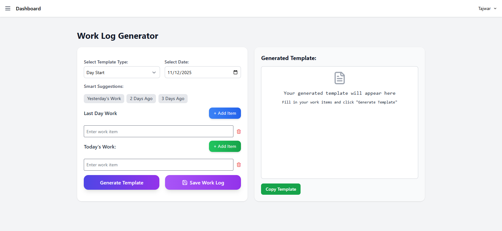

# 🧾 Laravel Work Log Generator

An interactive **Work Log Generator** built with **Laravel 12**, **Tailwind CSS**, and **JavaScript**.  
Allows users to **generate daily work logs**, **save them**, **fetch previous day work**, and **copy styled templates** seamlessly via AJAX.



---

## 🚀 Features

-   📅 **Day Start / Day End Templates**  
    Switch between daily work log modes.

-   🧠 **Smart Suggestions**  
    Prefill input fields with recent works from the previous day.

-   ➕ **Dynamic Item Fields**  
    Add or remove work items without losing existing inputs.

-   💾 **AJAX Saving**  
    Save work logs without page reload.

-   ✨ **Styled HTML Output**  
    Copy formatted HTML template with styles.

-   🔔 **Toast Notifications**  
    Subtle success messages for copy and save actions.

-   📱 **Responsive Layout**  
    Form on the left, generated template preview on the right.

---

## 🖥️ Tech Stack

-   **Backend:** Laravel 12, PHP 8.3+
-   **Frontend:** Blade Templates, Tailwind CSS, JavaScript
-   **Dependencies:**
    -   [TailwindCSS](https://tailwindcss.com/)
    -   [SweetAlert2](https://sweetalert2.github.io/) for notifications
    -   [Font Awesome](https://fontawesome.com/) for icons

---

## ⚙️ Setup Instructions

1. **Clone the repository:**

    ````bash
    git clone https://github.com/your-username/work-log-generator.git
    cd work-log-generator

    ```bash
    git clone https://github.com/your-username/work-log-generator.git
    cd work-log-generator

    ````

2. **Install dependencies:**
   composer install
   npm install
   npm run dev

3. **Configure environment:**
   cp .env.example .env
   php artisan key:generate

4. **Run migrations:**
   php artisan migrate

5. **Run the application:**
   php artisan serve

---

## 🧩 File Structure

work-log-generator/
├─ app/
│ └─ Http/
│ └─ Controllers/
│ └─ WorkLogTemplateController.php
├─ database/
│ └─ migrations/
│ └─ 2025_11_12_create_work_log_templates_table.php
├─ public/
│ └─ js/
│ └─ work-log-generator.js
├─ resources/
│ └─ views/
│ └─ work_logs/
│ ├─ generator.blade.php
│ └─ history.blade.php
├─ routes/
│ └─ web.php
├─ .env.example
├─ composer.json
├─ package.json
├─ tailwind.config.js
├─ vite.config.js
└─ README.md

---

## 📝 Routes

Route Method Purpose
/work-log-generator GET Show generator page
/work-log-generator-ajax POST Generate template via AJAX
/work-log-fetch-previous POST Fetch previous day's work
/work-log-save POST Save work log without generating
/work-log-history GET Show history of saved templates

---

## 📋 Usage

1. Select Template Type (Day Start / Day End)

2. Pick a Date

3. Use Smart Suggestions to prefill previous work

4. Add your work items using + Add Item button

5. Click Generate Template to view formatted output

6. Use Save Work Log to save without generating

7. Copy the generated template using the Copy button

🧑‍💻 Author

Tajwar
💼 Developer | 💬 Open for collaboration
📧 tajim.tajwar@gmail.com
